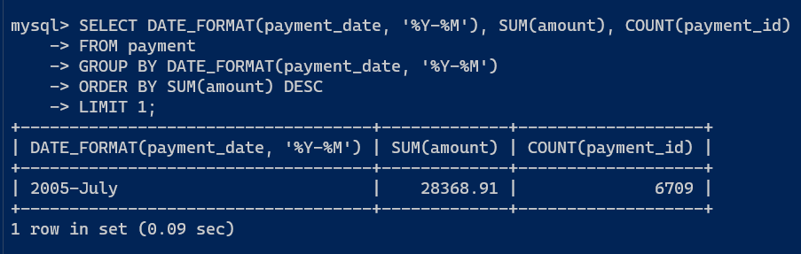

# Домашнее задание к занятию "`12-04hw`" - `Ливчак Сергей`

---

### Задание 1

`Одним запросом получите информацию о магазине, в котором обслуживается более 300 покупателей, и выведите в результат следующую информацию:
фамилия и имя сотрудника из этого магазина;
город нахождения магазина;
количество пользователей, закреплённых в этом магазине.`

1. `Основываясь на таблице staff, подтягиваем через другие таблицы данные.`
2. `В табилце staff нет информации о городе где находится магазин, вначале связываем таблицу staff с таблицей store по ключу store_id, В таблице store хранится информация об address_id, где в свою очередь можно найти информачию о городе.     `
3. `Нам нужно выяснить сколько покупателей обслуживается в магазине. Для этого мы подтянем данные из таблицы покупателей по ключу store_id`
4. `Группируем по staff_id лишь из-за того что без не сработает COUNT`
5. `Просим указать сотрудника со счётчиком больше 300`
6. 

```
SELECT CONCAT(staff.first_name, ' ',  staff.last_name), city.city, COUNT(customer.store_id)
FROM staff
INNER JOIN store ON staff.store_id = store.store_id 
INNER JOIN address ON store.address_id = address.address_id 
INNER JOIN city ON city.city_id = address.city_id 
INNER JOIN customer ON customer.store_id = staff.store_id
GROUP BY staff_id
HAVING COUNT(customer.store_id) > 300;
```

1. **12-04hw-1** 


---

### Задание 2

`Получите количество фильмов, продолжительность которых больше средней продолжительности всех фильмов.`
 

```
SELECT COUNT(*)
FROM film_list
WHERE film_list.length > (SELECT AVG(length) FROM film_list);

```

1. **12-04hw-2** 


---

### Задание 3

`Получите информацию, за какой месяц была получена наибольшая сумма платежей, и добавьте информацию по количеству аренд за этот месяц.`

1. `Оператором date_format из колонки payment_date таблицы payment выделяем данные в формате %Y-%M`
2. `Суммируем оплаты `
3. `Добавляем счётчик строк аренды`
4. `Группируем по формату %Y-%M`
5. `Ограничиваем вывод сортировки по сумме до 1 в порядке по убыванию суммы платежей`

```
SELECT DATE_FORMAT(payment_date, '%Y-%M'), SUM(amount), COUNT(payment_id)
FROM payment
GROUP BY DATE_FORMAT(payment_date, '%Y-%M')
ORDER BY SUM(amount) DESC
LIMIT 1;

```
1. **12-04hw-3** 


---